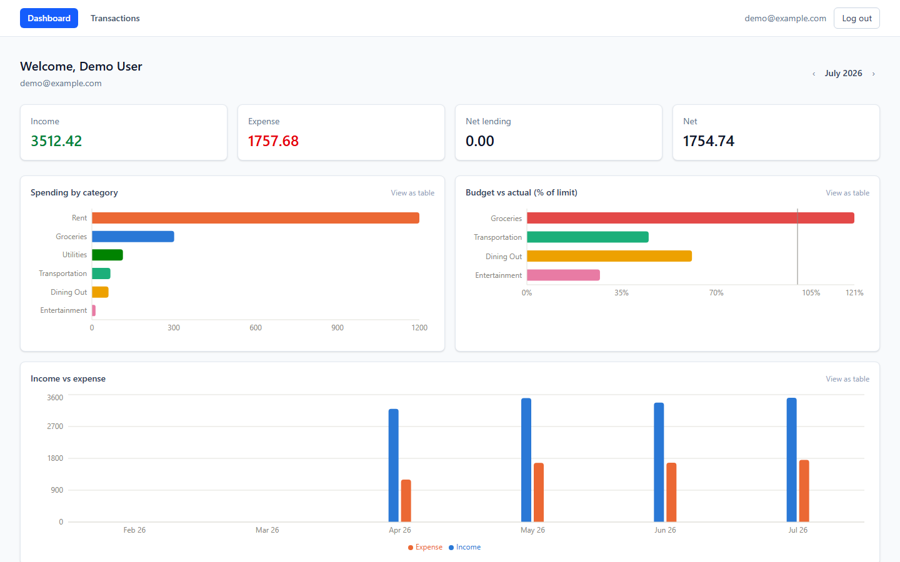
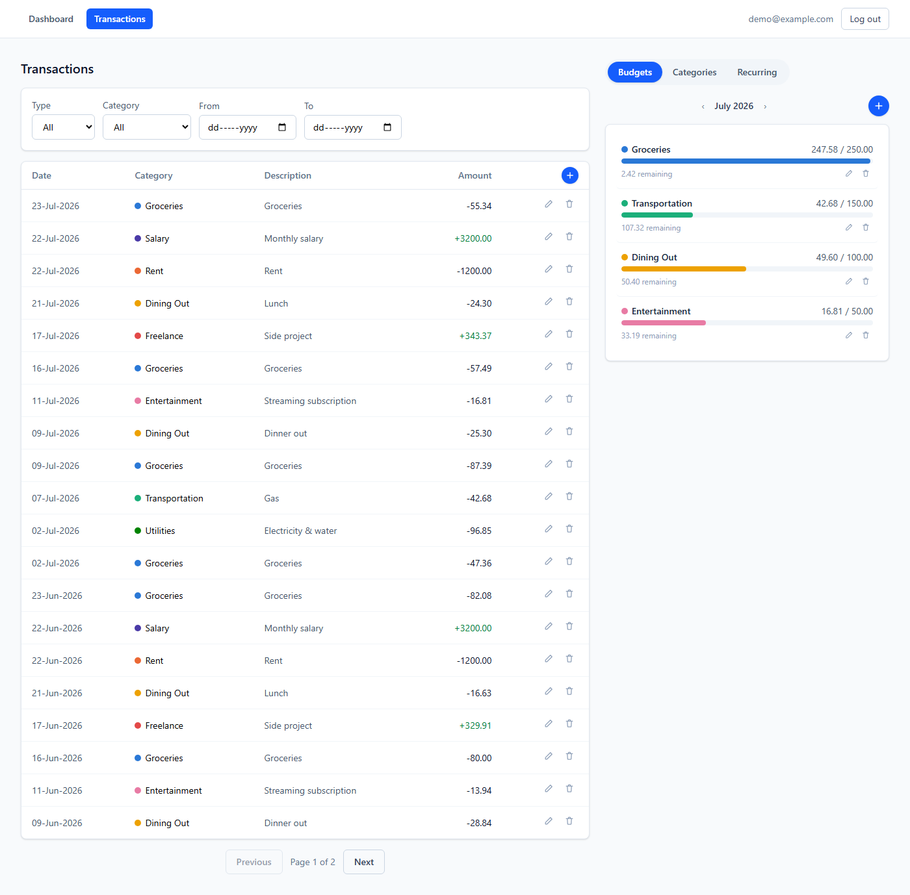
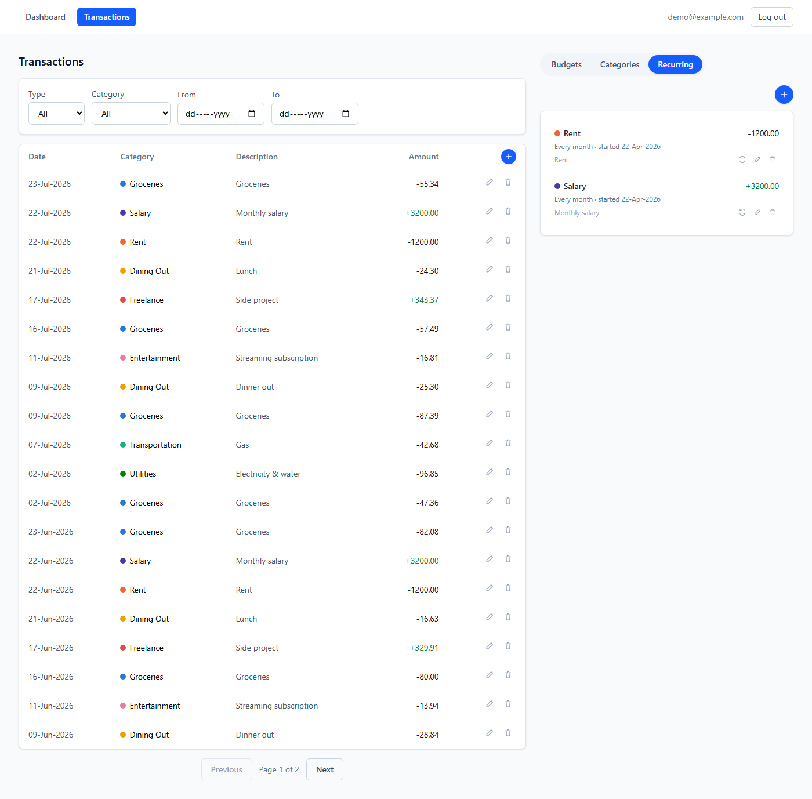
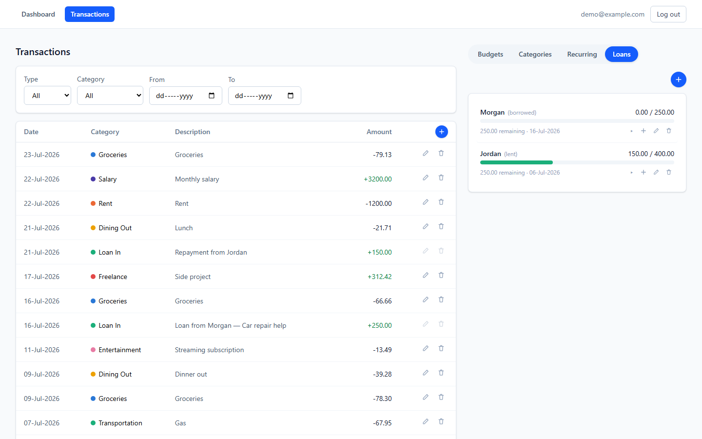

# Budget App


A personal budget management web app — track income and expenses, set monthly
budgets per category, automate recurring transactions, and visualize spending
with charts.

Built as a learning project for MongoDB/Mongoose (schema design, indexes,
aggregation pipelines) and as a portfolio piece.

## Screenshots

**Dashboard** — month-scoped KPIs and three aggregation-backed charts (spending
by category, income vs expense trend, budget vs actual), each with a
"view as table" accessibility twin.



**Transactions + Budgets/Categories/Recurring workspace** — one page, full
width: the transactions table is always the base view on the left, with a
tabbed panel on the right. Adding an item opens a popup; editing happens
inline in the row.



**Recurring transactions** — a template rule (e.g. "Every month") generates
real transactions over time, with manual "run now" and pause/resume.



**Loans** — money lent to or borrowed from someone, tracked as a real linked
transaction (so it affects actual balance, not a side ledger), with partial
repayments, a running outstanding balance, and write-off for debt that won't
be repaid.



## Tech stack

- **Client**: React 19, TypeScript, Vite, Tailwind CSS, React Router, TanStack Query, React Hook Form + Zod, Recharts
- **Server**: Node.js, Express, TypeScript, Mongoose, JWT auth (access + refresh tokens), Zod validation, node-cron
- **Database**: MongoDB (local via Docker, single-node replica set to support multi-document transactions)
- **Testing**: Vitest + Supertest (server integration tests against a real MongoDB), Vitest (client unit tests)
- **Monorepo**: npm workspaces (`client/`, `server/`, `shared/`)

## Why MongoDB?

This is the author's first project using a document database. The data model
deliberately contrasts two patterns: `Transaction` documents *reference*
`User`/`Category` by ObjectId (an unbounded, independently-growing collection —
the textbook case for referencing), while `RecurringTransaction` acts as a
small, stable template document that generates `Transaction` rows over time.
Budget-vs-actual spend and the dashboard charts are never denormalized —
they're computed live via MongoDB aggregation pipelines (`$match`, `$group`,
`$facet`, `$lookup`) so they can never go stale. Loans flip the pattern on its
head: a loan's repayments are bounded and always read with their parent, so
they're *embedded* subdocuments rather than referenced — and creating/repaying/
deleting a loan writes to both the loan and a linked transaction atomically via
a real MongoDB multi-document transaction. See
[docs/architecture.md](docs/architecture.md) for more detail.

## Project structure

```
budget-app/
├── client/     # React + Vite + TS frontend
├── server/     # Express + TS backend API
├── shared/     # TS types shared between client and server
├── docs/       # architecture notes + screenshots
└── docker-compose.yml   # local MongoDB for development
```

## Getting started

**Prerequisites**: Node.js 20+, Docker Desktop.

```bash
# 1. Install dependencies (also builds the shared types package)
npm install

# 2. Copy env files and adjust if needed
cp server/.env.example server/.env
cp client/.env.example client/.env

# 3. Start local MongoDB
npm run mongo:up

# 4. Start the app (shared types watcher + API + client, all together)
npm run dev
```

- Client: http://localhost:5173
- API: http://localhost:4000/api (health check at `/api/health`)
- Mongo Express GUI (optional, to browse the database visually):
  `docker compose --profile tools up -d` → http://localhost:8081

### Demo data

To try the app populated with a few months of realistic transactions, budgets,
and an active recurring rule, instead of an empty account:

```bash
cd server && npm run seed
```

Log in with **demo@example.com** / **password123**. Safe to re-run — it wipes
and recreates just that one demo account.

### Testing

```bash
npm test
```

Runs the server suite (Vitest + Supertest, against a dedicated
`budget-app-test` database on the same local Mongo container — never your dev
data) and the client suite. Requires `npm run mongo:up` first.

## Roadmap

- [x] M0 — Project scaffold, Docker Mongo, health check end-to-end
- [x] M1 — Mongo connection + User model
- [x] M2 — Auth (signup/login/refresh/logout)
- [x] M3 — Categories & Transactions CRUD
- [x] M4 — Budgets
- [x] M5 — Recurring transactions
- [x] M6 — Charts & dashboard
- [x] M7 — Polish, tests, seed data
- [x] M8 — Loans (money lent to / borrowed from someone — party, principal, running balance, repayments)

**Future work**: password reset, CSV import/export, dark mode, CI (GitHub Actions), live deployment.

## License

MIT — see [LICENSE](LICENSE).
